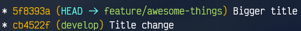

# Pruebas de fusión entre ramas
En este repositorio, simulamos la creación de un sitio web entre varios usuarios, los cuales no están muy sincronizados a la hora de trabajar y puede que haya *conflictos* a la hora de combinar los cambios de cada uno de ellos. 


## Merge
Vamos a empezar por lo más básico. Tenemos un repositorio con dos ramas. Tenemos el commit inicial en la rama `main`, y cambiamos a `develop` para seguir desarrollando.

Creamos unos cuantos commits en la rama de desarrollo y por fin terminamos nuestra tarea. Estamos listos para incluir esos cambios en la rama principal. Así es como está ahora mismo el historial: 


Sin complicarnos, hacemos un `merge` normal y corriente. Nos vamos a la rama destino y fusionamos los cambios de la rama origen.

```bash
git switch main
git merge develop
```

> **Note**  
> `git switch` es un comando añadido en las últimas versiones de git. Si no tenemos git suficientemente actualizado, usaremos el clásico `git checkout`.

El historial ahora está así:


Todos los cambios de `develop` ahora están en `main`. 

### Conflictos
Simulemos una situación de conflicto. De la rama `develop`, vamos a sacar dos ramas:

- `feature/welcome`: En esta rama, se añade un mensaje de bienvenida a la página principal.
- `feature/styles`: En esta, se cambia el color del título.

Supongamos que en cada rama está trabajando un usuario. En un momento dado, el usuario de `feature/welcome` se sale de su jurisdicción y decide que no le gusta el color del título, y pone uno de su preferencia. Esto tendrá consecuencias.

Ambos hacen commit de sus cambios, y el historial se ve así:


Vamos a fusionar los cambios de estilos a `develop`:


No hay problema. Los cambios se aplican en la rama destino. Ahora incluyamos los cambios de la otra rama:


Tenemos un ***conflicto***. Además, git nos chiva que es en el fichero `css/styles.css`, vamos a ese fichero en VS Code:


Nos dice que, en esa línea, vienen cambios diferentes en ambos lados. Ahora mismo, tiene el valor superior, en verde, pero en la rama entrante, se ha modificado la misma línea con un valor distinto. Debemos elegir si aceptamos el actual, el entrante, ambos o algo diferente.

En nuestro caso, nos quedamos con el cambio que ya tenemos, ya que es el que corresponde a la rama donde estábamos editando los estilos. El usuario trabajando en `feature/welcome` se ha excedido de sus límites y ha modificado un fragmento de código que no le correspondía.

Tras aceptar el cambio correcto, vamos a hacer un `git status`:


Nos dice que tenemos *unmerged paths*, es decir, que estamos en medio de un `merge` no finalizado. Nos da varias opciones, o bien abortar la fusión con `git merge --abort` o bien resolver los conflictos haciendo un commit. 

Si miramos más abajo, vemos que en `index.html` no hay conflictos, está marcado como listo para añadirse al commit, pues las modificaciones en ese archivo no sobrescriben nada en esta rama. Pero `css/styles.css` sigue marcado como modificado en ambos lados. Como ya lo tenemos resuelto, lo añadimos al stage para marcarlo como tal. De modo que lo que falta por hacer para resolver es:

```bash
git add css/styles.css
git commit -m "Merged branches"
```

Y el historial muestra las ramas correctamente fusionadas:


## Rebase
El cambio de base o `rebase` es otra técnica de incorporación de cambios entre ramas, además del `merge`.

`Rebase` hace algo opuesto a `merge`, pero que acaba obteniendo el mismo resultado. En lugar de traer todos los commits de una rama para sí misma, lo que hace es que posiciona todos los commits de la rama actual al final de la rama especificada. 

### Cuando aplicar un rebase
A partir de la rama `develop`, hemos creado la rama `feature/awesome-things` , en la cual vamos a trabajar, incorporando una serie de características increíbles. Aquí podemos verlas:


En `feature/awesome-things`, hemos aumentado el tamaño del título, y en `develop`, hemos cambiado el texto del título. No hay indicios de conflicto a la vista, pero podemos apreciar que el cambio en `develop` se hizo posteriormente a haber creado la rama secundaria, con lo cual dicho cambio no está incorporado en `feature/awesome-things`.

En este caso, nuestra rama sólo está perdiendo los cambios de un solo commit en `develop`. Sin embargo, si estamos mucho tiempo desarrollando en una rama, en un repositorio en el que colaboran muchos usuarios, es altamente probable que estemos perdiendo muchos cambios, lo cual aumenta la probabilidad de conflictos de fusión, y errores al ejecutar, si algún módulo ha tenido cambios drásticos en su interfaz y/o funcionamiento.

**Conclusión**: se recomienda que nuestras ramas vayan actualizándose con su rama "padre" de vez en cuando. Ahí entra el `rebase`.

### Como aplicar un rebase
El `rebase` se aplica exactamente igual que el `merge`. Debemos situarnos en la rama destino, es decir, en la que queremos incorporar los cambios. Después, hacemos el `rebase`, así:

```bash
git switch feature/awesome-things
git rebase develop
```


Veamos como ha quedado ahora el historial:



Vemos varias cosas. Lo primero, el historial ahora es lineal, no hay "ramificaciones". Y el commit con el cambio de tamaño está *después* que el de cambio de título.

Desde fuera, parece como si todos los commits de `feature/awesome-things` se hubiesen movido para colocarse delante del último commit de `develop`. Sin embargo, los commits no pueden "moverse", y una pista la tenemos en el hecho de que el commit `Bigger title` ahora tiene un identificador (un *hash*) distinto. Eso se debe a que **NO** es el mismo commit.

Internamente, lo que se ha hecho es **eliminar** todos esos commits y crear otros con las mismas modificaciones, pero partiendo (poniendo su ***base***) desde el final de la rama que queríamos incorporar (la rama origen).

> **Warning**  
> El `rebase` altera el historial, es decir, elimina commits y genera otros nuevos, con distinto código *hash*. Este tipo de técnicas no son recomendadas si hablamos de commits a los cuales otros usuarios tienen acceso.
> Si un usuario quisiera acceder a uno de esos commits, podría haber problemas si el `rebase` los elimina.

### Conflictos 
Puesto que estamos igualmente integrando cambios de una rama en otra, puede haber conflictos en el proceso. Vamos a hacer algo así.

Creamos dos ramas: `feature/add-text` y `feature/font-changes `. Añadimos unos cuantos commits en la primera:


Cambiamos a la segunda, donde queremos incorporar los cambios de la primera, para ir sincronizados:


Hacemos los cambios necesarios y creamos un commit:


Se ve genial, todo lineal. Ahora, de vuelta en `feature/add-text`, vemos que alguien se ha vuelto a salir de su campo de acción y ha cambiado la fuente:


En `feature/font-changes`, el usuario quiere volver a incorporar los cambios de `feature/add-text`. Empieza el show:


Esto es lo que obtenemos al tratar de hacer `rebase`. No es muy explicativo. Veamos qué muestra `git status`:


Esto ya nos aclara un poco, nos da varias opciones. Vamos a optar por continuar el `rebase` con `git rebase --continue`.


De nuevo más información, y ya empieza a parecerse al proceso de resolución de conflictos del `merge`. Tenemos que resolver manualmente, marcarlos como resueltos añadiendo al stage, haciendo commit y ejecutando `git rebase --continue`.

También podemos saltarnos ese commit o cancelar todo el `rebase`.

Continuemos. En VS Code, tenemos esta vista ya familiar:


Aquí hay algo interesante. Recordemos que estamos en `feature/font-changes`, queriendo incorporar `feature/add-text`. ¿Y tenemos los cambios hechos en el commit de `feature/font-changes` como *Incoming*? En realidad, tiene sentido, recordemos que `rebase` lo que hace es posicionar **nuestra** rama al final de otra. De modo que aceptamos en este caso los cambios entrantes.

Añadimos el cambio al stage y hacemos commit:


Por último, tal y como se nos dijo, ejecutamos `git rebase --continue`:


Por fin tenemos el conflicto resuelto. El árbol queda así:


> **Note**  
> Vemos que `rebase` genera árboles más limpios, pero tratar con los conflictos es mucho más difícil que con `merge`. Y no olvidemos el problema de la eliminación de commits. Nunca se avisa demasiadas veces.

### Rebase y push
`Rebase` altera el historial, con lo cual no es muy amigo de `push`. Vamos a ver un ejemplo:

Hemos creado una nueva rama, `feature/useful`, que contiene funcionalidades útiles para más de un usuario. 


A los colaboradores les vendría bien usar sus funcionalidades, de modo que, aunque no sea una rama principal, decidimos subirla al remoto.


Mientras tanto, la rama `develop` sigue incluyendo commits.


De hecho, a `feature/useful` le vendría bien incluir dichas funcionalidades. Así que se hace un `rebase`.


Veamos el árbol:


Ahora `feature/useful` está a continuación de `develop` y... ¿existe el mismo commit dos veces? ¿Qué ocurre aquí?

Pues que el commit que vemos abajo es el que está en la rama remota, que no se ha borrado.

En fin, vamos a hacer `push` de la rama, que tenemos nuevos cambios.


El `push` ha sido rechazado... porque mi rama está *¿detrás? * de su contraparte remota. Recordemos que antes hicimos rebase de esta rama con `develop`. Hemos cambiado el historial, y eliminado commits... de una rama que estaba **online**. Por eso git está tan confundido.

Nos pide algo inpensable: que hagamos `pull` de los cambios sin incorporar, ya que estamos *"detrás"*. Por extraño que parezca, lo hacemos, antes de subir nuestros cambios. Es decir:

```bash
git pull
git push
```

Después de eso, este es el árbol:


Esto es un ejemplo de un **mal** uso de `rebase`. Queríamos un historial claro, limpio y sin ramificaciones. Hemos terminado con un historial ramificado, poco entendible, con un commit duplicado, y habiendo tenido que hacer un `pull` (lo cual incluye un `merge`) que no aporta nada, para luego por fin poder hacer un `push`, que era lo único que queríamos, subir nuestros cambios.

> **Note**  
> Hay que tener muy claro que sabemos lo que hacemos al usar herramientas tan poderosas como `rebase`. Si no lo tenemos claro, podemos conseguir todo lo contrario a lo que pretendemos.

### Merge después de rebase
Después de ver los problemas y peligros de `rebase`, veamos un caso de muy buen uso del mismo. Combinando adecuadamente con `merge`.

Vamos a seguir con el fatídico ejemplo anterior, partiendo del commit en el que se solucionó todo. 

En `feature/useful` hemos ajustado el color al que cambia el título al hacer click, a uno más... *celestial*. Mientras tanto, `develop` ha avanzado por su propio camino. Así estamos:


Como buena práctica, queremos incorporar los cambios de `develop` en nuestra rama `feature/useful`. 

```bash
git rebase develop
```

Ahora tenemos esto:


La rama `feature/useful` se ha colocado encima de `develop`, y el historial es lineal. 

Tenemos los cambios de `develop` en `feature/useful`, pero queremos también incorporar los de `feature/useful` en `develop`, porque queremos lanzar una *developer preview*, por ejemplo.

Ya vimos lo que ocurrió al optar por incorporar cambios con `rebase` en una rama online, así que ni nos lo planteamos. ¿Y qué tal con `merge`? Probemos:

```bash
git merge feature/useful
```

Atención a la salida:


Ya hemos visto eso de `fast-forward` al principio, a hablar de `merge`, pero ¿qué significa? Pues significa que git no ha tenido que esforzarse mucho para resolver la fusión. La rama destino `develop` no ha tenido cambios y sólo tiene que incorporar los que le entran de `feature/useful`.

Lo único necesario es *adelantar* (*fast-forward*) el puntero de `develop` para que apunte al mismo sitio que `feature/useful`.

Veamos el árbol:


Precioso. Los cambios han sido incorporados a `develop`. El historial de `develop` no ha tenido cambios extraños, y además todo es lineal.

Esto ha sido posible porque gracias a un **buen** uso de `rebase`, las ramas han avanzado de manera sincronizada, sin llegar a diferir demasiado.

### Subámoslo
Ahora casi da miedo fastidiarla al hacer `push`, con tanto `rebase` y `merge` involucrado.

Infundado. Para empezar, en `develop` no hay problema:

```bash
git push
```

Y los cambios se suben:


Y ahora la rama `feature/useful`, que recordemos que también la queremos en el remoto.

Con un `git push`, podemos entrar en el mismo terreno fangoso que hemos visto anteriormente, ya que esta rama ha hecho algún que otro `rebase`. Existe una forma de arreglar eso.

Si pasamos `--force` a `git push`, estamos aplicando fuerza bruta y nuestros cambios sobrescribirán los que hay online, pudiendo destruir trabajo de otros colaboradores. Pero `--force-with-lease` no nos dejará seguir adelante si ese es el caso, al mismo tiempo que tampoco abortará si detecta un historial extraño. Digamos que prepara a `push` para que entienda los cambios hechos por `rebase`.

De modo que, situados en `feature/useful`, hacemos:

```bash
git push --force-with-lease
```

Y después de eso, este es el árbol:


Las ramas han sido subidas, no hemos tenido quebraderos de cabeza, y el historial está limpio y claro.

## Pull requests
Una ***pull request*** (o ***merge request***) permite que los usuarios soliciten aprobación de sus commits antes de ser incorporados a la rama base.

> **Note**  
> Podemos crear y controlar pull requests desde varias herramientas, como GitHub CLI, GitHub Mobile... Nosotros hemos elegido la versión web por su facilidad, y porque es la que siempre tendrá disponible todo el mundo.

Hemos creado la rama `feature/request` que incluye cambios en la estructura y apariencia de la página. 


Queremos solicitar que dichos cambios sean aprovados. Lo primero que necesitamos es subir la rama al remoto.

```bash
git push -u origin feature/request
```
> **Note**  
> El parámetro `-u`, o bien `--set-upstream` se usa la primera vez que tenemos que subir una rama a un repositorio, para indicarle el remoto y la rama remota a la que vincularlo.  
> Podemos usar el comando `git config push.autoSetupRemote true` para que git haga esto mismo por nosotros. Si además pasamos `--global` al comando, se aplicará en todos los repositorios que creemos.


Con la rama subida, nos vamos a la página del repositorio en GitHub a iniciar la pull request. Vemos que tenemos un mensaje en amarillo que nos indica que nuestra rama ha tenido cambios recientes.


Hacemos click en ***Compare & pull request***. Nos llevará a una página donde podremos crear nuestra pull request.


Nos pide dos ramas:
- **Base**: La rama a la cual queremos solicitar que se incorporen nuestros cambios. Por defecto, se selecciona la rama marcada como `default`, en este caso `main`. Pero nosotros queremos incorporar a `develop`.
- **Compare**: Rama que contiene los cambios a incorporar. En nuestro caso, `feature/request`.

Una vez elegidas, incluímos un título y descripción:


En el botón verde, podemos elegir mediante el desplegable si queremos crear una pull request o guardar lo que hemos escrito como borrador. Nosotros estamos listos para crearla.


Una vez creada, se nos dirigirá a la [página de pull requests del repositorio](https://github.com/JesusFerVid-ACN/MergeTesting/pulls), donde veremos un resumen de lo que acabamos de crear. 

Veremos que arriba del todo, aparecerá como estado **Open**. Casi al final, veremos esta sección:


Aquí podemos realizar diferentes acciones, como requerir la aprobación de ciertos usuarios. Además, se nos muestra que la rama no tiene conflictos con la rama base. Lo cual quiere decir que podemos fusionarlas.

El botón ***Merge pull request*** nos permite aceptar e incorporar los cambios a la rama destino. Tiene varias opciones para ello:


Cada equipo tiene sus preferencias. En nuestro caso, vamos con un *merge commit* normal y corriente. Elegimos la opción y pulsamos el gran botón verde.

También podemos añadir algún comentario extra a la pull request, o bien optar por cerrarla sin incluir los cambios.


> **Note**
> Normalmente, son otros usuarios los encargados de aprobar o rechazar los cambios, pero en este caso, somos el único usuario en el repositorio.

En caso de aceptar, una vez que hacemos click en  ***Merge pull request***, se nos pedirá un título y una descripción para un commit. Introducimos los datos y hacemos click en ***Confirm merge***.


La pull request pasará a estado **Merged** y será cerrada.


GitHub nos ha creado el commit con la fusión, así que de vuelta en nuestro repositorio local, en la rama `develop`, hacemos un `git pull`.


Comprobemos el árbol:


Tenemos los cambios que fueron aprobados en la rama `develop`.

## Stash
Para explicar lo que es el stash, imaginemos que tenemos unos cambios que enviamos a ser evaluados antes de ser incluidos en una *release*, pero mientras tanto seguimos desarrollando nuevas funcionalidades.

Pasado un tiempo, nos llaman diciendo que tenemos que modificar nuestro anterior trabajo, y nosotros estamos con una característica a medio desarrollar. No queremos perder el trabajo que tenemos ahora mismo por volver a la rama en la que desarrollábamos antes.

Una solución puede ser un commit. Guardamos nuestros cambios y nos libramos. Pero realmente ¿tiene sentido añadir un commit de algo hecho a medias? Y ¿qué pondríamos en el commit? No es muy agradable ver un mensaje de commit así:

```
Just to save my WIP

This is an unfinished feature, this commit only serves as a checkpoint so I don't lose my work before switching branches.
```

Por ello existe el ***stash***. Un espacio aparte en el que guardar cambios destinados a ser recuperados más tarde. En lugar de ensuciar el historial con un commit que no aporta nada, ponemos los cambios en un limbo, dejando limpio el *working tree*, y recuperamos dichos cambios más tarde.

### Guardar y recuperar cambios
Para guardar los cambios, simplemente usamos el comando `git stash`. 

Para recuperar los cambios, tenemos dos métodos: *pop* y *apply*. 
1. ***Pop***. Recupera los cambios almacenados en el *stash* y los borra del mismo.
2. ***Apply***. Recupera los cambios del *stash* sin borrarlos.

Ambos comandos actuarán sobre los últimos cambios almacenados (*LIFO*), porque sí, se puede tener más de un *stash*, pero no entraremos ahí de momento.

### No todo se guarda
El comando `git stash` **no** guardará cambios que no estén en el *stage* (*unstaged*) ni ficheros ignorados. Hay varias formas de solucionar esto.

1. Añadir los ficheros manualmente y hacer un `stash` como ya sabemos.
   ```bash
   git add .
   git stash
   ```
2. Usar el flag `-u` o `--include-untracked` para guardar también los cambios que no están en el *stage*. Con esto seguimos dejando fuera los ficheros ignorados.
   ```bash
   git stash -u
   ```
3. Usar e parámetro `-a` o `--all` para guardar todo, incluso ignorados.
   ```bash
   git stash -a
   ```
